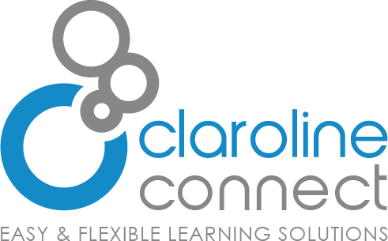

# Claroline Connect - Technical guide

Welcome to the official technical guide for the Claroline Connect LMS ([Learning Management System](https://en.wikipedia.org/wiki/Learning_management_system)).

This documentation covers the installation and the architecture of the Claroline platform, of its
core and its plugin system. It also includes information on best practices and
references to useful external resources.

For user documentation, see : [Claroline Connect Documentation](http://doc.claroline.com).
