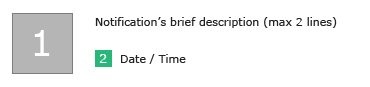
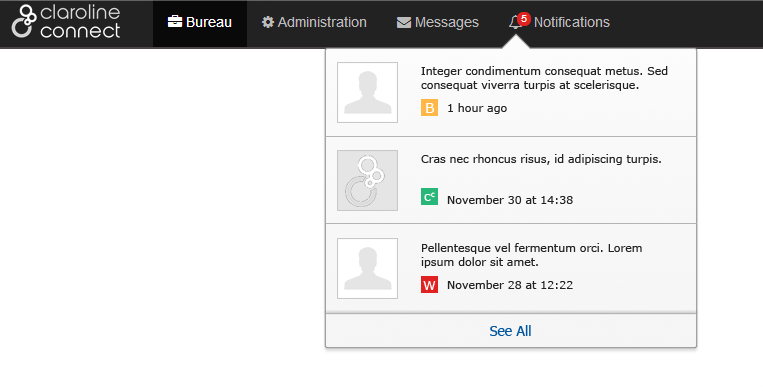
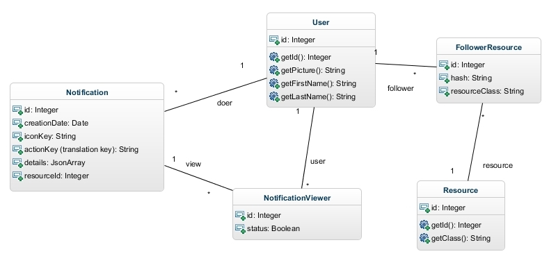
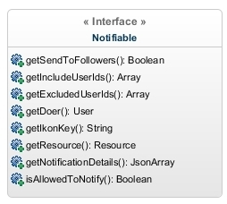

# Notification plugin

Notifies users on new events or activities. The idea was to develop a system which behaviour would be similar to other known notification systems (facebook’s notifications, google+ notifications etc.).


## Features

*	Tied up with Log system (log events can generate notification)
*	Works with Listeners to display notifications
*	Builds a view template using the entity’s attributes
*	Has its own translation domain (notification.lang.yml)
*	To avoid system overload, only notifications that are less than 2 months old are stored.


## Template



A notification is divided in four parts:
*	The avatar of the user whose action raised the notification (square 1)
*	A short text describing the action (ex. John Doe enrolled you in “Anatomy” as “Student” if the doer is a user or if the doer is the platform: You have been enrolled as “Collaborator” in “Anatomy”)
*	An icon depending on the notification type (blog icon if action refers to a blog resource, wiki icon if action refers to a wiki resource, platform icon if is a generic action etc.). This icon is generated automatically using the name of plugin.
*	The date the action took place (square 2), presented in a sort of “smart” format (3 hours ago, yesterday at 10:30, November 30 at 15:10 etc.) 

Below it’s given a concrete example of the notification representation:




## List of actions that can push a notification

The actions that raise a notification can be divided in two categories, depending on the level of the target entity. Thus, we have the notifications happening inside and outside a workspace and those happening inside a resource.


### Workspace level notifications

A user receives a notification only if he is enrolled to the workspace.

*	**Enroll group to a workspace**: Notifies the group users
*	**Enroll user to a workspace**: Notifies the target user
*	**Give access to a resource**: Notifies users that they can access the resource


### Resource level notifications

If a user wants to receive notifications of actions taken place inside a resource (plugin) he has to enable the functionality in the resource options (option “Notify me”). 
This notification category, contains all those notifications defined by inside each plugin. (Post creation in a Forum, Article creation in Blog, new comment in post etc.)


### Structure (Entities, Relationships, Tables)

In the diagram below it is shown the table structure for the Notification System. As we can see there is the Notification table (entity) linked though a many to one relationship with the user (doer, the one whose action resulted the notification) but also linked through a one to many relationship with the NotificationViewer table (entity). The NotificationViewer is essentially the intermediate entity that connects a user (viewer) to a notification (view) as a user can receive many notifications and a notification can be diffused to many different users. There is a status attribute in the NotificationViewer class that changes when the notification has been seen by the user. Thre is also the FollowerResource entity that connects a user to a resource and informs a system that a specific user follows a resource (has enabled notifications for this resource).

The User and Resource entities are not defined inside the plugin. They are external entities used by the plugin. As such, they must provide the following methods: getId(), getPicture(), getFirstName(), getLastName() for User entity and getId(), getClass() for Resource entity. 




### Implementation

The implementation of the notification system is achieved through the “Notifiable” interface. Every log event that can raise a notification must implement the notifiable interface. This interface contains all the information about the users that need to be informed, (if the notification will be sent to the resource’s followers, it can include other users as well or even exclude ones). It also contains all necessary data to create a notification (date, action, icon etc.).




## How to use in plugins

In order to integrate and enable notifications in a Claroline connect plugin you need to follow these steps:

1.  Add
    ``
    somewhere in your interface to render the button that allows user to enable and disable notifications for a resource.     As you can see, 2 parameters are required, the resource node id and the resource node class.

    
2.  Any event that you want to generate a notification needs to implement the *NotifiableInterface*. This interface has 9 methods.
    -   getSendToFollowers() : returns true or false if event can notify the resource's followers
    -   getIncludeUserIds() : returns a list of User ids that will receive the notification (extra Users that are not necessarily in followers list)
    -   getExcludeUserIds() : returns a list of User ids that must not receive the notification (this Users can be either in followers list or includeUsers list)
    -   getDoer() : returns the User whose action raised the notification (this method already exists in LogGenericEvent class)
    -   getActionKey() : returns a sting with the name/key of the action performed
    -   getIconKey() : returns a string, usually the name of the resource type e.g. "wiki" and is used to generate a color for every notification that has the same icon name. This color is the mini icon's background color and as text content for this icon is used the first letter of the icon key.
    -   getResource() : returns the resource on which the action was performed (this method already exists in LogGenericEvent class)
    -   getNotificationDetails() : returns an array (JsonArray in database) which contains information about the resource name, id and type as well as other information, necessary to render the notification text. All the information about the "doer" are added by the Notification plugin automatically. All the rest (resource, etc.) need to be added manually.
    -   isAllowedToNotify() : returns true or false and informs CoreBundle that this event raises or not a notification. It can test a condition and if this condition fails no notification is created or sent, else if condition is fulfilled a notification is created and sent to users.

    You can use the example of the [LogContributionCreateEvent](https://github.com/iCAPLyon1/WikiBundle/blob/master/Event/Log/LogContributionCreateEvent.php) in the WikiBundle to guide you.

3.  Create a domain for translations under translations folder following the name pattern `notification.lang.yml`
4.  Under views folder create a `Notification` folder and store inside all views related to notifications' display/rendering. It is recommended to create a general twig file say `notification_item.html.twig` which will extend the `IcapNotificationBundle:templates:notification.html.twig` template, will render all common elements and include any other necessary template according to the action type. An example is given [here](https://github.com/iCAPLyon1/WikiBundle/blob/master/Resources/views/Notification/notification_item.html.twig)
5.  Create listener, for example [`NotificationListener`](https://github.com/iCAPLyon1/WikiBundle/blob/master/Listener/NotificationListener.php) and service e.g. [`listeners.yml`](https://github.com/iCAPLyon1/WikiBundle/blob/master/Resources/config/services/listeners.yml) is the example for WikiBundle
6.  `*new`Create listener, [`NotificationUserParametersListener`](https://github.com/iCAPLyon1/WikiBundle/blob/master/Listener/NotificationUserParametersListener.php) to enable user activate and deactivate the display of your notifications

You can find a complete example of these steps in [iCAPLyon1/WikiBundle](https://github.com/iCAPLyon1/WikiBundle)

Please enable notification only for events that inform of content creation/addition. Not for content deletion. Otherwise a user will be lost in a "notification overload".


### Integrate user tagging in plugins

If you want to allow users to tag and notify other users then you should follow these steps:

1.  For every entity in your plugin that contains text, implemented by a tinymce editor (for example a post in a blog, a contribution in a wiki etc.) you need to create:
    -   A protected variable to store the user picker object (contains the information about the original text, the final text, as long as the list of tagged users)
        ```
            protected $userPicker = null;
        ```
    -   Develop a `@ORM\PrePersist` method that instanciates userPicker and swaps originalText with finalText.

        ```
        /**
        * @ORM\PrePersist
        */
         public function createUserPicker(LifecycleEventArgs $event){
             if ($this->getText() != null) {
                 $userPicker = new UserPickerContent($this->getText());
                 $this->setUserPicker($userPicker);
                 $this->setText($userPicker->getFinalText());
             }
         }
        ```
    -   Create an entity listener class and associate it with your entity. Here is an example (for Contribution entity in WikiBundle):
        ```
            @ORM\EntityListeners({"Icap\WikiBundle\Listener\ContributionListener"})
        ```
        This entity Listener is responsible to create a notification and notify every tagged user on entity's postPersist event.
        [Here](https://github.com/iCAPLyon1/WikiBundle/blob/master/Listener/ContributionListener.php) is the example of the Contribution listener.

2.  Add in `listeners.yml` file a line for the new event.
    Example:

    ```
        - { name: kernel.event_listener, event: create_notification_item_resource-icap_wiki-user_tagged, method: onCreateNotificationItem }
    ```
3.  Handle the rendering of the new notification event. (Create dedicated view etc.)
    [Here](https://github.com/iCAPLyon1/WikiBundle/blob/master/Resources/views/Notification/notification_user_tagged.html.twig) is this view for the wiki bundle and [here](https://github.com/iCAPLyon1/WikiBundle/blob/master/Resources/views/Notification/notification_item.html.twig)
    is the modified notification_item view to include the new event.


## Future expansion (Real Time Notification Push and API)

This expansion is about adding a real time functionality to the Notification System. This functionality will be developed but it will stay optional, because for a real time system we need a “push” server (NodeJS or other). If a NodeJS server is installed then it would be possible to enable the functionality in the plugin’s parameters. The necessary files and functions would be present all the time, but loaded and called only if the real time option is enabled.

A future expansion will also provide with an API to receive User notifications.
